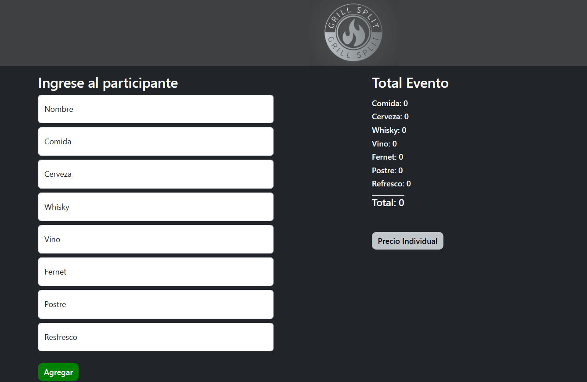
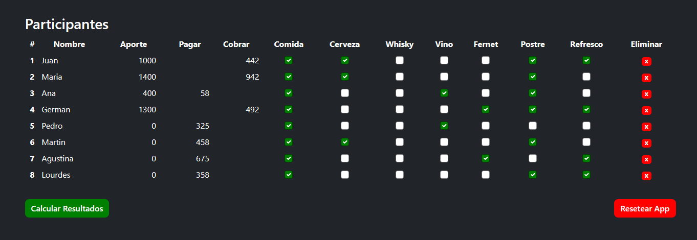
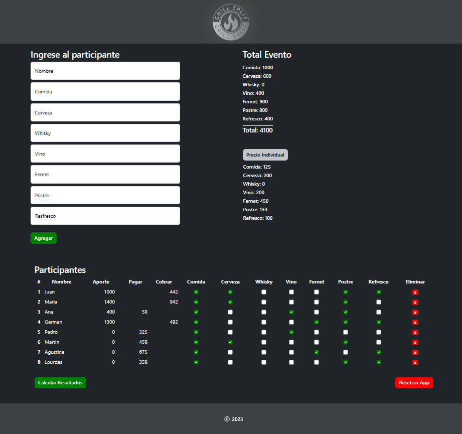

# GrillSplit

GrillSplit es una aplicación web para dividir los gastos de una asado entre los participantes. Permite realizar un seguimiento de las contribuciones de cada persona y calcular cuánto debe pagar o recibir cada uno al final del evento dependiendo de lo que consumio.

## Funcionalidades

- **Registro de Participantes**: Agrega participantes con detalles sobre su aporte en comida, bebida, etc.
- **Cálculo Automático**: Selecciona las casillas dependiendo de lo consumido por cada particpiante y calcula automáticamente la contribución individual y muestra cuánto debe pagar o recibir cada participante.
- **Interfaz Intuitiva**: Interfaz de usuario fácil de usar para una experiencia sin complicaciones, sin necesidad de crear usuarios ni registrarse.

## Capturas de Pantalla

## Tecnologías Utilizadas

- React
- Bootstrap
- Vite
- HTML
- CSS
